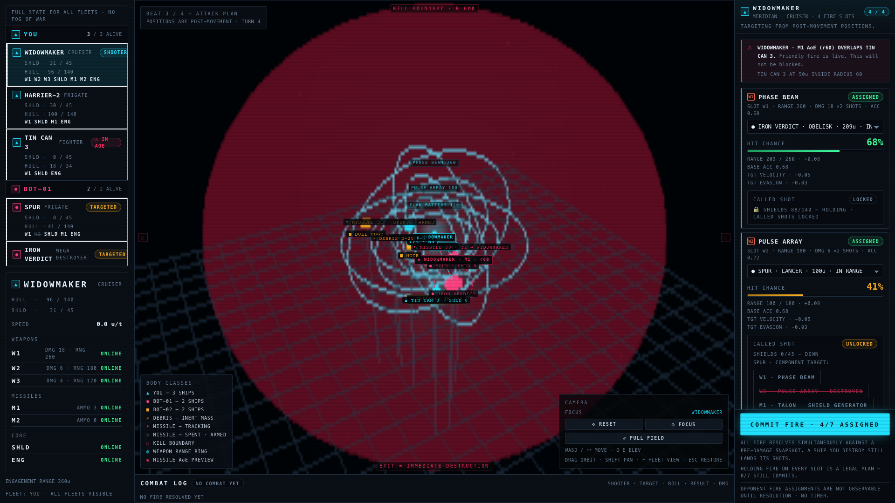

# [▶ PLAY STARSHIP SKIRMISH LIVE](https://john-paul-ruf.github.io/starship-skirmish/)

> **Build the ship. Plot the burn. Survive the wreckage.**

**Starship Skirmish** is a 3D turn-based fleet tactics game where every battle begins in the Shipyard. Design warships one hard choice at a time, draft a fleet against a point budget, and face up to four enemy commanders in a neon tactical arena where **every order resolves at once**.

No twitch reflexes. No fog of war. No cheap stat boosts.

Just your fleet, your prediction, and the consequences.

  

> _“I killed his destroyer—and the wreck took out my own cruiser two turns later.”_

## The War Starts in the Shipyard

Choose from **12 hulls across four weight classes**, then fill each ship with the weapons, shields, missiles, engines, and special systems that define how it fights.

Every point creates a tradeoff:

- **Mount the siege cannon** and hit like a meteor—or buy the engine that might keep you alive.
- **Stack heavy shields** to survive the first volley—or trust fast regeneration to win the long fight.
- **Bring missile racks** for brutal area damage—and accept that every warhead can hit the wrong target.
- **Build one monster** or unleash a pack of cheap, evasive killers.

Name your creations, tag them, duplicate them, trade them with friends, and build an Encyclopedia full of ships worth arguing about.

## Every Turn Is a Wager

Combat unfolds in two beats:

1. **Plot movement.** Spend thrust, bend trajectories, coast on existing momentum, or gamble on an overburn.
2. **Commit.** Every fleet moves simultaneously. Nobody gets to revise an order after seeing yours.
3. **Assign fire.** Pick targets, launch missiles, hold shots, and call exposed enemy systems.
4. **Commit again.** Every weapon fires from the same frozen moment—even a ship destroyed in the volley still gets its shots off.

You are never racing a clock. Take the time to make the right call. Then watch the battlefield prove you wrong.

## Space Remembers Every Mistake

The arena is not a backdrop. It is the deadliest combatant on the field.

- **Momentum is debt.** There is no free stop. Every aggressive burn becomes tomorrow's problem.
- **The boundary kills.** Cross it and the ship is gone. Ram an enemy across it and the problem is theirs.
- **Wreckage keeps moving.** Destroyed ships explode into debris that can gut anything in its path—including you.
- **Missiles outlive their guidance.** They hunt for two turns, then become armed ballistic hazards screaming through the battlespace.
- **Friendly fire is always live.** Explosions do not care whose fleet is nearby.
- **Shields can be broken. Systems can be killed.** Once a target is exposed, cripple its engine, silence its guns, empty its missile rack, or destroy the shield generator before it recovers.

The longer a battle runs, the more dangerous the arena becomes. There is no safe corner and no clean endgame—only a growing storm of bad decisions moving at combat speed.

## Choose Your Weight Class

| Class              | What it brings to the fight                                                                                 |
| ------------------ | ----------------------------------------------------------------------------------------------------------- |
| **Fighter**        | Speed, evasion, and the confidence to make terrible close-range decisions.                                  |
| **Frigate**        | Flexible firepower in a hull cheap enough to field in numbers.                                              |
| **Cruiser**        | Serious armor, layered systems, and enough guns to control an engagement.                                   |
| **Mega Destroyer** | A fleet anchor with catastrophic firepower—and a point cost that dares the enemy to prove it was a mistake. |

## The Enemy Plays by Your Rules

Face **one to four rival fleets** at Rookie, Veteran, or Ace difficulty. They use the same ships, the same point budget, the same blind commitments, and the same lethal boundary you do.

They do not cheat. They just get meaner.

## Victory Has One Definition

**Be the last fleet standing.**

There is no turn limit. No points tiebreak. No draw awarded because the battle became inconvenient. If weapons cannot finish the job, the shrinking margin for error will: drifting wreckage, spent warheads, bad momentum, and the red wall waiting at the edge of space.

## Your Fleet Is Waiting

Build something elegant. Build something reckless. Build the ship your opponent will complain about after it kills them.

### [ENTER THE SHIPYARD →](https://john-paul-ruf.github.io/starship-skirmish/)
