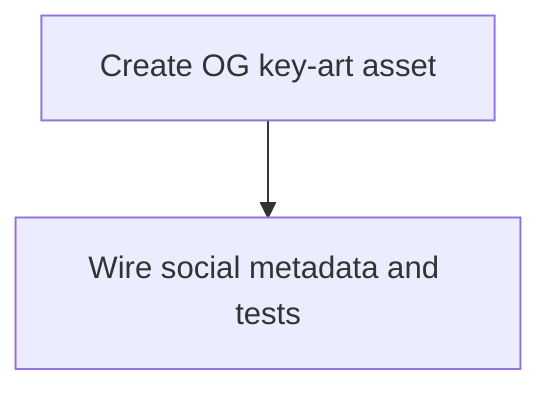

# State Tracker — Starship Skirmish / og-social-card

## Program / Feature / Intent / Sessions

- **Program:** Starship Skirmish
- **Feature:** `og-social-card`
- **Intent:** Add a polished 1200 × 630 Open Graph/Twitter social preview image and wire the
  static GitHub Pages entry document to it with crawler-contract tests.
- **Sessions:** 2 (S01–S02), 2 waves.
- **Nature:** Static marketing asset + entry-document metadata. No runtime UI, simulation, catalog,
  persistence, routing, or package changes.
- **Production URL:** `https://john-paul-ruf.github.io/starship-skirmish/`
- **Image URL:** `https://john-paul-ruf.github.io/starship-skirmish/og-card.png`

## Session Status

| # | Session | Modules | Owns | Status | Checkpoint | Completed | Notes |
|---|---|---|---|---|---|---|---|
| 01 | Create OG key-art asset | M01 | `./public/og-card.png` | pending | 0/2 | — | Resumed under the Codex worker binding at the user's request after the prior Zen authentication block; no lease work survived. |
| 02 | Wire Open Graph and Twitter metadata | M01, M19 | `./index.html`, `./tests/unit/toolchain/openGraph.test.ts` | pending | — | — | Depends on S01's final PNG; add absolute production URLs and contract-test the metadata plus PNG IHDR. |

(Status: pending | in-progress | done | blocked | skipped. Checkpoint: last committed checkpoint, or —.)

## Wave Plan

| Wave | Sessions | Why concurrent |
|---|---|---|
| 1 | SESSION-01 | The image asset has no predecessor and is the hard artifact dependency for the metadata contract. |
| 2 | SESSION-02 | Runs after S01 because its test must validate the real `./public/og-card.png` path, bytes, and 1200 × 630 dimensions. |

## Dependency Graph

## Architecture Reference

- **M01 static surface:** `./public/og-card.png` is a deployment asset, and `./index.html` is the
  crawler-visible document head. Vite already copies `./public/` files and the existing Workbox
  pattern includes PNG assets; no build configuration change is needed.
- **M19 contract surface:** `./tests/unit/toolchain/openGraph.test.ts` uses Node/Vitest only,
  matching the existing no-DOM toolchain test posture.
- **No new module or public runtime API:** the game remains a static SPA; no Preact component,
  router route, service, catalog entry, or analytics integration is introduced.
- **Visual inheritance:** the asset must use the design tokens documented in `./specs/design.md`
  and the visual language in `./mocks/console.css`: `#05070A`/`#000205`, cyan primary signals,
  magenta/amber fleet identity, red lethal boundary, orange debris, wireframe geometry, glow not
  shadow, and crisp JetBrains Mono-like display lettering.
- **Crawler contract:** metadata uses one absolute HTTPS production URL and one absolute PNG URL;
  no hash route, relative image, external host, data URL, runtime script, or CSP relaxation.

## Scope Summary

| Module | Affected scope | Untouched |
|---|---|---|
| M01 | `./public/og-card.png`, `./index.html` | `./package.json`, `./vite.config.ts`, `./public/.nojekyll`, all runtime source |
| M19 | `./tests/unit/toolchain/openGraph.test.ts` | Existing test suites and all simulation/UI tests |

## Design Decisions

- **PNG at `./public/og-card.png`:** Open Graph consumers are most reliable with a raster image;
  1200 × 630 is the standard large-preview ratio and leaves enough space for the tactical scene
  and readable title.
- **Crisp overlay typography:** generated art may supply the neon geometry, but title/tagline
  lettering is composed locally so the exact game name and promise are not left to probabilistic
  image text rendering.
- **Static absolute GitHub Pages URLs:** the current deployed README link is the authoritative
  public origin. Metadata is for crawlers, so it must not depend on client-side hash routing or
  JavaScript. A future custom-domain change should update this contract explicitly.
- **Open Graph plus Twitter tags:** both major preview consumers receive the same title, promise,
  image, dimensions, and alt text; no platform-specific copy drift is introduced.
- **Two sequential sessions:** S01 and S02 have disjoint leases, but S02's contract test reads
  and validates S01's actual PNG. The artifact dependency is real, so serial waves avoid a false
  green test against a missing image.
- **No runtime dependency or code-native screen:** this is marketing chrome at the static entry
  boundary, not game state. The app's offline and determinism architecture remains untouched.

## Granularity Note

2 sessions for 2 ownership units: one asset lease and one entry-document/test lease. The split is
**not effort-based**; it follows the file sets and the hard artifact dependency. S02 cannot finish
its real PNG-dimension contract until S01 has committed `./public/og-card.png`, so the sessions
are two sequential waves rather than concurrent peers. No session was split for a context-ceiling
reason, and neither session is verification-only or docs-only.

## Handoff Notes

*(Jikijitsu writes here after each session, verbatim from Mu's handoff JSON `notes` + `followUp`.)*

- **SESSION-01:** No Mu handoff JSON was received. The replacement Zen session failed with `Claude Code authentication failed: Failed to authenticate: OAuth session expired and could not be refreshed`. Git confirms zero committed checkpoints and a clean `./public/og-card.png` lease. `SESSION-02` remains pending behind this blocked dependency.
- **Recovery:** The user requested a Codex re-run. SESSION-01 is pending again at checkpoint 0/2; the prior Zen handle is discarded and no lease work needs recovery.
