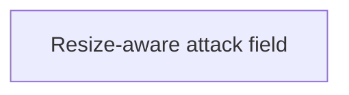

# State Tracker — Starship Skirmish / tactical-attack-full-field-resize

## Program / Feature / Intent / Sessions

- **Program:** Starship Skirmish (`starship-skirmish`)
- **Feature:** `tactical-attack-full-field-resize`
- **Intent:** Keep the Assign Weapons tactical renderer, camera projection, and DOM field overlays synchronized with the real viewport size when `FULL FIELD` expands or restores the center stage.
- **Sessions:** 1
- **Authoritative program config:** `./program/starship-skirmish/FORGE-CONFIG.md`
- **Design source:** `./specs/design.md`, `./mocks/tactical-attack.html`, and the owner-provided 2048×996 defect screenshot.
- **Database impact:** none; `./specs/database.md` was read and no catalog, storage, schema, codec, lockfile, or migration surface is in scope.

## Session Status

| # | Session | Modules | Owns | Status | Checkpoint | Completed | Notes |
|---|---|---|---|---|---|---|---|
| 01 | Keep Attack Full Field Proportional | M14, M19 | `./src/ui/screens/tacticalAttack/Viewport.tsx`; `./tests/e2e/tacticalAttack.spec.ts`; `./tests/e2e/tacticalAttack.spec.ts-snapshots/attack-plan*.png` | done | 2/2 | 2026-08-28 | Fixed: Attack viewport never resized its TacticalView on mount or container change. Added a ResizeObserver bound to the .viewport container (canvas.parentElement) with an immediate positive-size resize before setState/first label pass and before the overlay RAF starts; disconnects before dispose. Extended the stub harness with a recording resize() + strengthened the FULL FIELD stub test to assert resize calls match live container geometry through expand/restore. Added a real-render regression at 2048×996 (the owner's report) plus the established 1920×1080/1280×720 gates proving canvas backing-store size + aspect track the live viewport through expand/restore, and a new reviewed FULL FIELD screenshot baseline (attack-plan-full-field-1920.png) showing a proportional kill boundary and correctly reprojected overlays. The pre-existing normal attack-plan-1920.png baseline was reviewed and needs no update — it was already correctly sized at mount; only the immersive-resize path was broken. |

## Wave Plan

| Wave | Sessions | Why concurrent |
|---|---|---|
| 1 | SESSION-01 | Single member: the observer implementation, recording harness, real-render regression, and screenshot baselines share one coherent M14/M19 working set and the same test files. |

## Dependency Graph

## Architecture Reference

- **Dependency flow:** `catalog → domain → {io, sim, ai} → {render, persist} → ui → app`, from `./program/starship-skirmish/FORGE-CONFIG.md`.
- **M13 resize seam:** `./src/render/TacticalView.ts` already owns renderer, bloom, camera-aspect, line-resolution, picking, label, and `worldToScreen` dimension updates through `TacticalView.resize`. This feature consumes that seam and does not edit M13.
- **M14 lifecycle ownership:** `./src/ui/screens/tacticalAttack/Viewport.tsx` dynamically creates/disposes the view, so it also owns observing the actual viewport container and forwarding positive dimension changes.
- **Immersive contract:** retain `D-IMMERSIVE-GRID-COLLAPSE`: `FULL FIELD` is an in-frame grid collapse, not the browser Fullscreen API. The same view instance and camera state survive expand/restore.
- **Visual contract:** FR-13/FR-14/FR-16 and `./specs/design.md` require a readable proportional 3D tac display, persistent free camera, and always-legible boundary. A stretched sphere or stale screen projection violates readability even when the DOM layout is correct.
- **Browser gate:** retain `D-TA-VISUAL-GATE` and `D-TA-NO-DEFERRED-BROWSER` from `./program/starship-skirmish/prompts/tactical-attack-mock-parity/STATE.md`: real M13 rendering, unmasked visual evidence, and an executed browser test are required.
- **Data layer:** no changes to `./catalog/`, `./src/io/`, `./src/persist/`, or DB-owned migration artifacts.

## Scope Summary

| ID | Module | Scope | Public/API Impact |
|---|---|---|---|
| M14 | UI | Add immediate + observed container resizing to the Attack viewport's existing tactical-view lifecycle. | Internal lifecycle correction only; no component prop, controller, route, or render API change. |
| M19 | Tests | Record resize delivery, reproduce 2048×996 full field with real M13, and review normal/full-field visual baselines. | Adds stronger browser acceptance evidence; no production API. |

## Design Decisions

1. **D-TA-CONTAINER-IS-SIZE-TRUTH:** use the live `.viewport` container's positive `clientWidth/clientHeight` for every resize. No hard-coded rail subtraction and no window-size proxy.
2. **D-TA-IMMEDIATE-PLUS-OBSERVED:** size once immediately after view creation, then use `ResizeObserver` for grid collapse, restore, and any later container change.
3. **D-TA-ONE-RESIZE-SEAM:** call `TacticalView.resize` only. Do not duplicate renderer sizing, DPR capping, camera-aspect math, line resolution, or projection caches in M14.
4. **D-TA-NO-RECREATE:** expand/restore the existing view. Never remount it or reset orbit/focus merely to pick up dimensions; FR-14 camera persistence remains intact.
5. **D-TA-IMMERSIVE-SEMANTICS-STABLE:** this defect report is visual/projection repair. Keep the current fixed-frame `FULL FIELD` behavior and do not add OS-level fullscreen without a separate owner decision.
6. **D-TA-OWNER-VIEWPORT-REGRESSION:** mechanically exercise 2048×996, the dimensions of the reported failure, in addition to the established 1920×1080 and 1280×720 gates.
7. **D-TA-UNMASKED-FULL-FIELD-GATE:** the full-field screenshot includes the real canvas and DOM overlays. Passing hidden-column geometry alone is insufficient.

## Known Verification Baseline

- `npm run typecheck` currently reaches the pre-existing, out-of-scope `TS6142` at `./tests/unit/ui/encyclopedia/export.test.ts:31` because `./tsconfig.node.json` has no JSX setting.
- `npx tsc --noEmit -p ./tsconfig.json` and `npm run lint -- --quiet` are green before this feature.
- SESSION-01 must report the aggregate baseline but may not edit `./tsconfig.node.json` or the Encyclopedia test under this lease.

## Handoff Notes

_(Jikijitsu writes here after the session, verbatim from Mu's handoff JSON — `notes` + `followUp`.)_

### SESSION-01 — done · 2026-08-28 · checkpoint 2/2 · Mu→Enso

**notes:** Fixed: Attack viewport never resized its TacticalView on mount or container change. Added a ResizeObserver bound to the .viewport container (canvas.parentElement) with an immediate positive-size resize before setState/first label pass and before the overlay RAF starts; disconnects before dispose. Extended the stub harness with a recording resize() + strengthened the FULL FIELD stub test to assert resize calls match live container geometry through expand/restore. Added a real-render regression at 2048×996 (the owner's report) plus the established 1920×1080/1280×720 gates proving canvas backing-store size + aspect track the live viewport through expand/restore, and a new reviewed FULL FIELD screenshot baseline (attack-plan-full-field-1920.png) showing a proportional kill boundary and correctly reprojected overlays. The pre-existing normal attack-plan-1920.png baseline was reviewed and needs no update — it was already correctly sized at mount; only the immersive-resize path was broken.

**followUp:** No architectural change (M14 still calls only the existing M13 public TacticalView.resize seam) — no arch fragment written. If CI observes intermittent timeouts on the new full-field regression tests under load, consider raising playwright.config.ts's global test timeout for this spec rather than loosening the geometry tolerances, which are already tuned tight (≤2-3px) against real measured DPR-scaled backing-store output.

**layoutClasses (verbatim):** `["desktop"]`

**evidence (verbatim):** `[{"shot":"attack-plan-1920-chromium-darwin.png","note":"pre-existing normal baseline reviewed — kill boundary already reads as a proportional circle, HUD/rails/log all correctly positioned; confirms this fix does not touch center-column sizing."},{"shot":"attack-plan-full-field-1920-chromium-darwin.png","note":"new reviewed FULL FIELD baseline — kill boundary reads as a proportional circle (not the owner's stretched ellipse), range rings circular, HUD/legend/camera panels correctly anchored at the four corners of the expanded frame, labels/pills reprojected onto the shooter cluster."}]`

**a11yNotes (verbatim):** No focus-trap change — the immersive toggle button and Escape-to-restore keyboard path (already shipped by SESSION-04) are unaffected by this resize-lifecycle fix. No inert/aria-hidden residue introduced.
