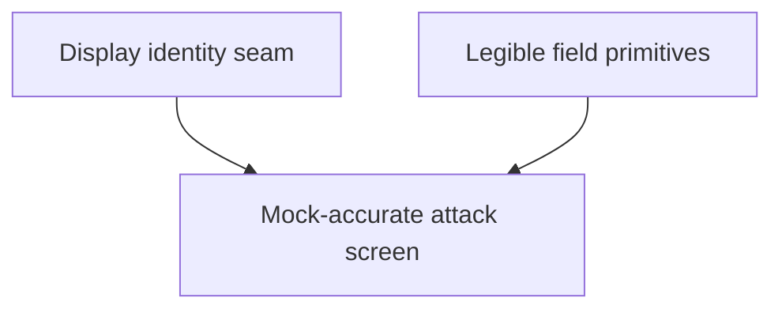

# State Tracker — Starship Skirmish / tactical-attack-mock-parity

## Program / Feature / Intent / Sessions

- **Program:** Starship Skirmish (`starship-skirmish`)
- **Feature:** `tactical-attack-mock-parity`
- **Intent:** Rebuild Tactical Attack to the stable mock contract: a true left roster / center tactical field / right fire-assignment rail; weapon cards and commit inside the right rail; center-only combat log; readable labels, wire range circles, firing lines, and controller-derived percentages.
- **Sessions:** 3
- **Authoritative program config:** `./program/starship-skirmish/FORGE-CONFIG.md`
- **Stable design source:** `./specs/design.md` plus `./mocks/tactical-attack.html` and `./mocks/console.css`
- **Database impact:** none; `./specs/database.md` was read and no data-store/schema/migration work is in scope.

## Session Status

| # | Session | Modules | Owns | Status | Checkpoint | Completed | Notes |
|---|---|---|---|---|---|---|---|
| 01 | Preserve Tactical Display Identity | M05, M06, M19 | `./src/sim/types.ts`; `./src/domain/resolveFleet.ts`; `./tests/unit/domain/resolveFleet.test.ts` | done | 2/2 | 2026-08-28 | Additive SimDisplayIdentity + optional chassis/display fields; resolveShip always populates them; no gameplay/digest change. |
| 02 | Build Legible Tactical Field Primitives | M13, M19 | `./src/render/TacticalView.ts`; `./src/render/labels.ts`; `./src/render/range.ts`; `./tests/unit/render/labels.test.ts`; `./tests/unit/render/range.test.ts` | done | 3/3 | 2026-08-28 | M13 tactical labels are semantic + visible (ship/debris/missile-tracking/missile-spent), priority-aware, hazard-capped at 24, and text is built from pure helpers. RangeShell now emits three orthogonal great-circle LineLoops under a Group (mesh: Object3D) instead of a translucent SphereGeometry — the wire envelope preserves omnidirectional read without washing over ship glyphs. |
| 03 | Rebuild Tactical Attack to the Mock Contract | M14, M19 | `./src/ui/screens/TacticalAttack.tsx`; `./src/ui/screens/tacticalAttack/Viewport.tsx`; `./src/ui/screens/tacticalAttack/FieldOverlay.tsx`; `./src/ui/screens/tacticalAttack/WeaponBench.tsx`; `./src/ui/screens/tacticalAttack/CalledShotPicker.tsx`; `./src/ui/screens/tacticalAttack/CommitBar.tsx`; `./src/ui/screens/tacticalAttack/model.ts`; `./tests/unit/ui/tacticalAttack/layout.test.ts`; `./tests/unit/ui/tacticalAttack/model.test.ts`; `./tests/e2e/tacticalAttack.spec.ts`; `./tests/e2e/tacticalAttack.spec.ts-snapshots/**` | pending | — | — | Depends on both foundational artifacts; real browser evidence is mandatory. |

## Wave Plan

| Wave | Sessions | Why concurrent |
|---|---|---|
| 1 | SESSION-01, SESSION-02 | The identity seam and renderer primitives have literally disjoint `Owns`. Neither requires the other's output; both are hard artifacts consumed by SESSION-03. |
| 2 | SESSION-03 | Single member because it consumes both Wave 1 artifacts and owns the coherent Tactical Attack UI/test working set. |

## Dependency Graph

## Architecture Reference

- **Dependency flow:** `catalog → domain → {io, sim, ai} → {render, persist} → ui → app` from `./program/starship-skirmish/FORGE-CONFIG.md`.
- **Identity seam:** catalog-authored IDs/names cross only through `./src/domain/resolveFleet.ts` into behavior-free optional fields on `./src/sim/types.ts`; production resolution always populates them.
- **Render boundary:** `./src/render/` reads sim types/state and produces pixels/DOM labels only. It has no mutation path into sim and performs no assignment or hit-chance logic.
- **UI truth:** `./src/ui/screens/tacticalAttack/model.ts` may arrange published values, but `hitChanceFor` remains the sole hit-chance source.
- **Blind commit:** field solutions are derived only from the local player's staged assignment map. Opponent pending plans remain unreachable and unobservable.
- **Design contract:** `./mocks/tactical-attack.html` is authoritative for composition and visual vocabulary. The attached owner screenshot is corroborating evidence, not a replacement for the stable workspace mock.
- **Data layer:** no catalog schema, ordinal, lockfile, localStorage, codec, database, or migration change.

## Scope Summary

| ID | Module | Scope | Public/API Impact |
|---|---|---|---|
| M05 | Domain | Preserve catalog identity while resolving fleets. | `resolveShip` output gains populated display metadata; numeric behavior is unchanged. |
| M06 | Sim: Physics / shared types | Add behavior-free optional display identity to resolved sim structs. | Additive `SimDisplayIdentity` and fields only; no rule/digest semantics. |
| M13 | Render | Make tactical labels readable/semantic and range envelopes line-based. | `LabelDatum` grows semantic presentation fields; `RangeShell.mesh` may become an `Object3D`/group while lifecycle methods remain. |
| M14 | UI | True three-column attack frame, selected-shooter rail, live overlays, mock parity. | Internal tactical-attack component/model props change; controller/match public seams stay intact. |
| M19 | Tests | Replace false containment proof with exact geometry and real-render/CSS visual evidence. | Adds reviewed Chromium snapshot baseline; no production API. |

## Design Decisions

1. **D-TA-MOCK-IS-CONTRACT:** `./mocks/tactical-attack.html` is the acceptance source, not merely card inspiration. Layout, hierarchy, overlays, and density must read as the same screen using live data.
2. **D-TA-THREE-COLUMN:** Attack plan is literally three siblings: left all-fleet roster, fluid center stage, right fire rail. Target widths are 288px / fluid / 344px at 1920px, bounded to roughly 260–288px / fluid / 320–344px at 1280px.
3. **D-TA-NO-BOTTOM-PLAN:** No weapon bench or commit control may live below the tactical field or span the page. The mock's combat log remains under the center column only. This supersedes the earlier false `.ta-col-r` center-stack interpretation.
4. **D-TA-RAIL-SHOOTER:** The right rail renders one active player shooter. Friendly roster/canvas selection changes it; enemy focus does not. Assignments for inactive shooters remain staged, and the commit count stays fleet-wide.
5. **D-TA-PRESERVE-DISPLAY-IDENTITY:** Resolved combat structs retain authored IDs/names as behavior-free metadata. Optional type fields keep legacy fixtures compatible; production resolver population is tested as mandatory.
6. **D-TA-WIRE-RANGE:** Weapon envelopes are thin line geometry, never translucent filled spheres. All live weapon ranges for the active shooter are visible and labeled; missile AoE remains a separate red/dashed overlay.
7. **D-TA-LIVE-OVERLAYS:** Boundary labels, range labels, solution lines, pills, selected/AoE callouts, legend, and beat HUD derive from current state/assignments. Production JSX must not hardcode the mock's ships, distances, or percentages.
8. **D-TA-HIT-CHANCE-SINGLE-SOURCE:** Percentage pills and rail meters format only `hitChanceFor(...).final`; out-of-range and missile lines show explicit non-percent states.
9. **D-TA-LABEL-SCALE:** Ships outrank hazards during deterministic declutter, and hazard labels are capped deterministically so the 300-body ceiling remains usable.
10. **D-TA-VISUAL-GATE:** Stubbed interaction tests are insufficient. Completion requires real shipped CSS, real M13 rendering, exact bounding-box checks at 1920×1080 and 1280×720, side-by-side mock review, and a reviewed Chromium screenshot baseline.
11. **D-TA-NO-DEFERRED-BROWSER:** The e2e/visual gate may not be marked done without execution. A missing dev server is a blocker to resolve during the session, not a permissible deferred verification note.

## Handoff Notes

_(Jikijitsu writes here after each session, verbatim from Mu's handoff JSON — `notes` + `followUp`.)_

### SESSION-01 — done · 2026-08-28 · checkpoint 2/2

**notes:** Additive SimDisplayIdentity + optional chassis/display fields; resolveShip always populates them; no gameplay/digest change.

**followUp:** SESSION-03 (UI) can rely on `shooter.ship.chassis?.name` and `shooter.ship.weapons[i].display?.name` / `missiles[i].display?.name` for authored labels via the BlindShipView.ship pass-through (already unchanged in src/sim/loop/blindView.ts). Fields are optional at the type boundary — SESSION-03 must keep a textual fallback for synthetic/legacy fixtures that construct SimShip literals directly (e.g. hand-authored deterministic unit tests). Fallback pattern: `ship.chassis?.name ?? ship.chassisClass.toUpperCase()` and `weapon.display?.name ?? 'WEAPON'` / `rack.display?.name ?? 'MISSILE RACK'`. Point-defense and decoys also carry `display` (available for future UI surfacing). SimDisplayIdentity is NOT re-exported from src/sim/index.ts — SESSION-03 can either import it deep from '../../sim/types.js' or use it structurally via SimShip.chassis; adding the barrel export is a trivial single-line addition if they want it in their lease.

### SESSION-02 — done · 2026-08-28 · checkpoint 3/3

**notes:** M13 tactical labels are semantic + visible (ship/debris/missile-tracking/missile-spent), priority-aware, hazard-capped at 24, and text is built from pure helpers. RangeShell now emits three orthogonal great-circle LineLoops under a Group (mesh: Object3D) instead of a translucent SphereGeometry — the wire envelope preserves omnidirectional read without washing over ship glyphs.

**followUp:** SESSION-03 (mock-parity screen rebuild) can drive the concentric mock rings by instantiating one RangeShell per live weapon envelope on the active shooter; the shell computes no to-hit, so screen-side hitChanceFor is still single-sourced (arch §13.3). presentationFor(kind, fleet) and the four pure text builders (shipLabelText/debrisLabelText/trackingMissileLabelText/spentMissileLabelText) are the reusable seam for the WeaponBench / rail so glyph + color coding stays consistent across screens. RangeShell.mesh widened from Mesh to Object3D — both existing consumers (Viewport.tsx + the tacticalAttack e2e stub) only pass it into scene.add/remove which accept Object3D, so no edit required, but SESSION-03 authors adding new consumers should treat mesh as Object3D. The e2e visual gate SESSION-03 owns will exercise these primitives against the real Chromium baseline; if a real-browser projection issue surfaces, projectToScreen and the priority-aware declutter are both pure and unit-covered so regressions land as failing tests, not silent visual drift.
